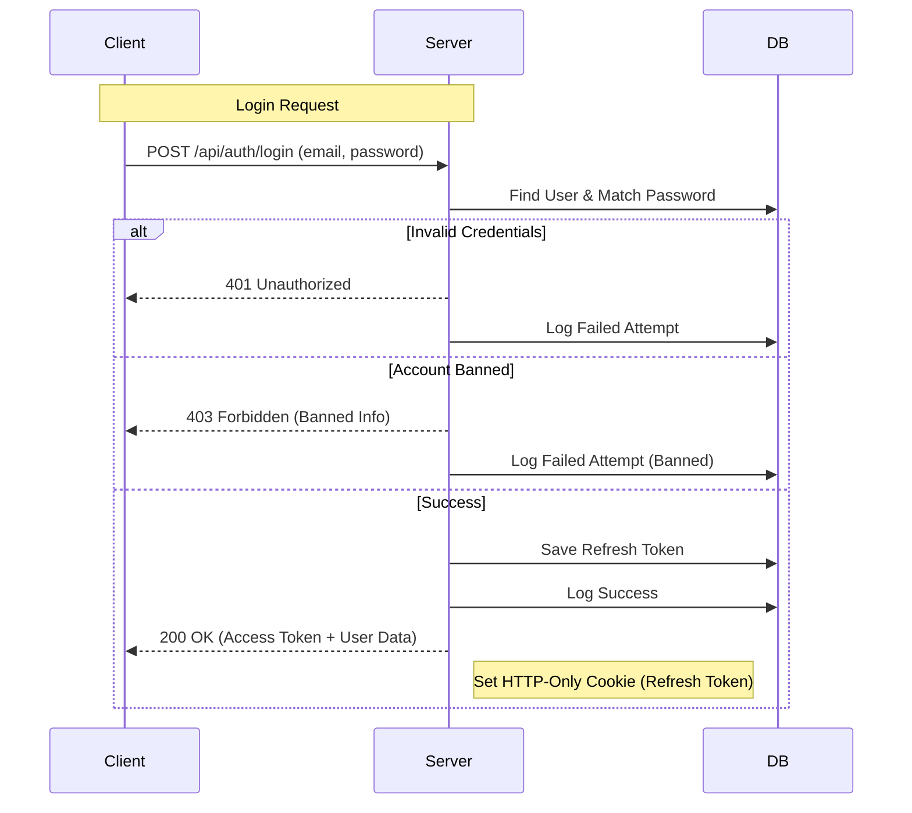

# Login & Authentication System Documentation

## Overview

The Link Snap authentication system is designed with "military-grade" security principles, ensuring robust protection for user accounts and data. It implements industry-standard protocols including JWT (JSON Web Tokens), Refresh Token Rotation, HSTS, Rate Limiting, and comprehensive Audit Logging.

---

## Table of Contents

1. [Security Architecture](#security-architecture)
2. [Authentication Flow](#authentication-flow)
3. [Registration Process](#registration-process)
4. [Login Process](#login-process)
5. [Token Management](#token-management)
6. [Audit Logging](#audit-logging)
7. [Frontend Resilience](#frontend-resilience)
8. [Error Handling](#error-handling)

---

## Security Architecture

### 1. Network Security

- **HSTS (HTTP Strict Transport Security):** Enforces secure connections (HTTPS) for 1 year (`max-age=31536000`), including subdomains and preload.
- **Helmet Headers:** Protects against common attacks (XSS, Clickjacking, Sniffing).
- **Rate Limiting:**
  - **API Limiter:** 100 requests/15min per IP.
  - **Auth Limiter:** 10 login/register attempts/hour per IP.
  - **Trust Proxy:** Configured to correctly identify client IPs behind load balancers/proxies.

### 2. Session Security

- **JWT Access Tokens:** Short-lived (15 minutes) for API access.
- **Refresh Tokens:** Long-lived (7 days) HTTP-only cookies for session renewal.
- **Token Rotation:** A new refresh token is issued every time the old one is used.
- **Reuse Detection:** If a used refresh token is presented again (sign of theft), **all** sessions for that user are immediately invalidated.

### 3. Account Security

- **Password Policy:** Minimum 8 characters required.
- **Email Verification:** Optional but recommended (configurable in Admin Settings).
- **Ban System:** Immediate session termination upon ban.

---

## Authentication Flow



---

## Registration Process

### Validation

- **Email:** Must be a valid email format.
- **Password:** Minimum 8 characters.
- **Duplicate Check:** Ensures email is unique.

### Flow

1. **User submits form:** Email, Password, Name, etc.
2. **Server validates:** Zod schema validation.
3. **Verification Check:**
   - If `requireEmailVerification` is ON:
     - User created with `isVerified: false`.
     - Verification token generated.
     - Email sent with link.
     - Response: "Please check your email".
   - If OFF:
     - User created with `isVerified: true`.
     - Tokens generated immediately.
     - User logged in automatically.

---

## Login Process

### 1. Input Validation

- **Email:** Valid format required.
- **Password:** Required.

### 2. Security Checks

- **Rate Limit:** Checks if IP has exceeded 10 attempts/hour.
- **User Existence:** Checks if email exists in DB.
- **Password Match:** Bcrypt comparison.
- **Ban Status:** Checks `isActive` flag. If false, returns 403 with ban reason.
- **Verification Status:** If required, checks `isVerified`. If false, returns 401.

### 3. Session Creation

- **Access Token:** Signed JWT containing User ID.
- **Refresh Token:** Random secure string.
- **Storage:**
  - Refresh Token -> Hashed/Stored in DB `user.refreshTokens` array.
  - Refresh Token -> Sent as `httpOnly`, `secure`, `sameSite` cookie.
  - Access Token -> Sent in JSON response body.

### 4. Audit Log

- Every attempt is logged to `LoginHistory` collection.
- Records: `userId`, `email`, `ip`, `userAgent`, `status` (success/failed), `failureReason`.

---

## Token Management

### Refresh Token Rotation (Anti-Replay)

This is a critical security feature to prevent token theft.

1. **Normal Flow:**

   - Client sends `RefreshToken A`.
   - Server verifies `A` is in DB.
   - Server deletes `A` and issues `RefreshToken B`.
   - Client receives `B`.

2. **Attack Scenario (Token Theft):**
   - Attacker steals `RefreshToken A`.
   - User uses `A` -> Server rotates to `B`.
   - Attacker tries to use `A`.
   - Server sees `A` is invalid/used but associated with user.
   - **Security Action:** Server assumes theft and **deletes ALL refresh tokens** for that user.
   - **Result:** Both User and Attacker are logged out. User must re-login (securely).

---

## Audit Logging

The `LoginHistory` model tracks all authentication events for security analysis.

### Schema

```javascript
{
  userId: ObjectId,      // Linked user (if found)
  email: String,         // Email attempted
  ip: String,            // Client IP
  userAgent: String,     // Browser/Device info
  status: 'success' | 'failed',
  failureReason: String, // e.g., "Invalid credentials", "User is banned"
  createdAt: Date        // Timestamp
}
```

### Usage

- **Admin Panel:** Admins can view login history for any user to detect suspicious activity (e.g., logins from unknown IPs).
- **Security Analysis:** Helps in identifying brute-force attacks or compromised accounts.

---

## Frontend Resilience

The `AuthContext.jsx` provider handles the client-side authentication state with resilience against network issues.

### Features

1. **Initial Check:** On load, calls `/api/auth/me` to validate session.
2. **Retry Logic:**
   - If `/api/auth/me` fails with a network error (e.g., server restarting), it retries **3 times** with a 1-second delay.
   - Prevents users from being logged out during brief server maintenance.
3. **Error Distinction:**
   - **401/403:** Definitive logout (invalid session).
   - **Other Errors:** Treated as temporary network issues (retry).
4. **Ban Handling:**
   - Intercepts 403 responses with `banned: true`.
   - Redirects immediately to `/account-suspended`.
   - Stores ban reason in SessionStorage for display.

---

## Error Handling

| HTTP Code | Scenario                   | Client Action                             |
| --------- | -------------------------- | ----------------------------------------- |
| **200**   | Login Success              | Store Access Token, Redirect to Dashboard |
| **201**   | Register Success           | Store Access Token, Redirect to Dashboard |
| **400**   | Validation Error           | Show Toast Error (e.g., "Invalid email")  |
| **401**   | Invalid Creds / Unverified | Show Toast Error                          |
| **403**   | Banned User                | Redirect to Suspended Page                |
| **429**   | Rate Limit Exceeded        | Show "Too many attempts" message          |
| **500**   | Server Error               | Show "Something went wrong"               |

---

_Last Updated: December 3, 2025_
