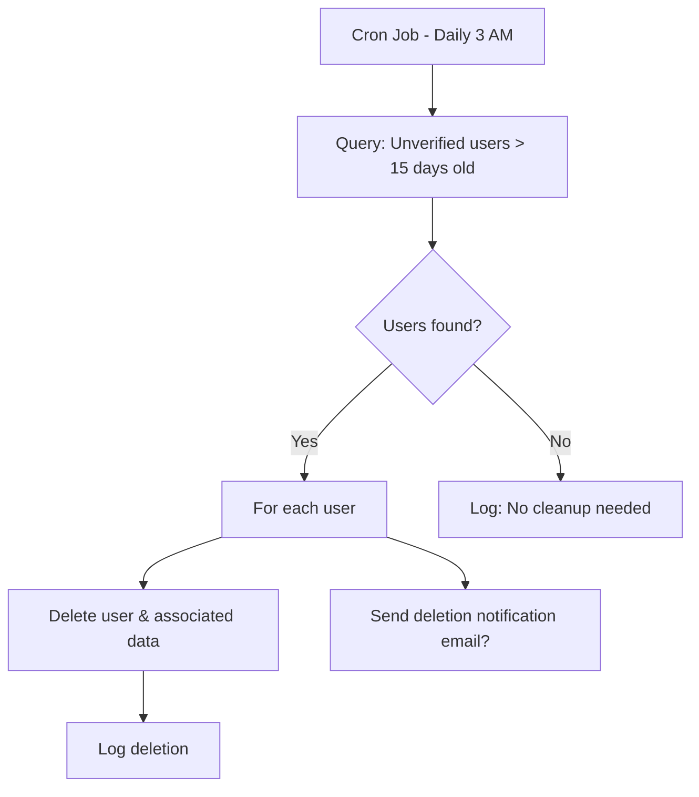

# Auto-Delete Unverified Users Feature

## Overview

Automatically delete user accounts that remain unverified for 15+ days after creation. Uses a scheduled background job to check `createdAt` timestamp from database - does NOT run on server startup.

---

## Architecture



---

## Proposed Changes

### Backend

#### [NEW] Cleanup Service
File: `server/services/cleanupService.js`

```javascript
// Scheduled job (node-cron or node-schedule)
// Runs daily at 3 AM server time
// Queries DB for: isVerified=false AND createdAt < (now - 15 days)
// Deletes matching users
```

---

#### [MODIFY] Server Startup
File: `server/server.js`

```javascript
// Import and start cleanup scheduler
// Does NOT run cleanup on startup - only schedules future runs
import { startCleanupScheduler } from './services/cleanupService.js';
startCleanupScheduler();
```

---

#### [NEW] Admin Settings (Optional)
File: `server/models/Settings.js`

```javascript
// Add configurable options:
autoDeleteUnverifiedUsers: { type: Boolean, default: true },
autoDeleteAfterDays: { type: Number, default: 15 },
```

---

#### [MODIFY] Admin Controller
File: `server/controllers/adminController.js`

```javascript
// Manual trigger endpoint for testing
POST /api/admin/cleanup-unverified-users

// View pending deletions
GET /api/admin/unverified-users-to-delete
```

---

### Frontend (Optional)

#### [MODIFY] AdminDashboard.jsx
- Toggle to enable/disable auto-delete
- Change deletion period (7, 15, 30 days)
- "Preview" button to see who will be deleted
- Manual "Clean Up Now" button

---

## ⚠️ Edge Cases & Potential Issues

### 1. Data Integrity
| Issue | Risk | Mitigation |
|-------|------|------------|
| User has linked data (links, analytics) | Orphaned records | Cascade delete or clean up related data first |
| User was about to verify | Deletes right before verification | Don't delete users with OTP generated in last 1 hour |
| Admin deletes config while job runs | Undefined behavior | Re-fetch settings at start of each run |

### 2. Race Conditions
| Scenario | Issue | Mitigation |
|----------|-------|------------|
| User verifies while being deleted | Partial deletion | Use transaction or re-check isVerified before delete |
| Multiple server instances run job | Duplicate work/errors | Use distributed lock (Redis) or single-instance flag |
| Job runs during peak hours | DB load | Run at 3 AM, use batch processing |

### 3. Timing Issues
| Issue | Mitigation |
|-------|------------|
| Server timezone vs user timezone | Use UTC everywhere |
| 15 days = 15*24hrs or 15 calendar days? | Define clearly: 15 * 24 * 60 * 60 * 1000 ms |
| Daylight saving time edge cases | Use moment.js or date-fns for reliable calculations |
| Server clock skew | Use MongoDB's `$$NOW` or database time |
| Job runs twice if server restarts at 3 AM | Track last run timestamp in DB |

### 4. Recovery
| Issue | Mitigation |
|-------|------------|
| Accidentally deleted important user | Soft delete first, hard delete after 7 more days |
| Need to restore user | Keep deletion logs with serialized user data for 30 days |
| Wrong users deleted due to query bug | Dry-run mode first, require admin confirmation |

### 5. Email Edge Cases
| Scenario | Behavior |
|----------|----------|
| User signed up with typo in email | Will be deleted (can't receive OTP anyway) |
| Email provider was down during signup | User never got OTP, may be unfairly deleted → grace period |
| User's spam filter blocked OTP | Send reminder before deletion |

### 6. Database Edge Cases
| Scenario | Risk | Mitigation |
|----------|------|------------|
| User document partially corrupted | Delete fails | Skip and log, alert admin |
| `createdAt` field missing | Never deleted or always deleted | Add default check, skip if missing |
| Index missing on isVerified + createdAt | Slow query blocks DB | Ensure compound index exists |

### 7. Concurrent Modification
| Scenario | Risk | Mitigation |
|----------|------|------------|
| Admin modifying user during cleanup | Data inconsistency | Use `findOneAndDelete` with version check |
| User updating profile during delete | Partial save | Transaction or atomic operations |
| Password reset initiated for unverified user | Reset tokens orphaned | Delete PasswordReset documents too |

---

## 🔒 Security Considerations

### 1. Data Protection
| Risk | Severity | Mitigation |
|------|----------|------------|
| Deleted user's email reused by attacker | HIGH | Blacklist email for 30 days after deletion |
| PII in logs | MEDIUM | Only log user ID, hash email if needed |
| Audit trail missing | MEDIUM | Log: timestamp, user ID, deletion reason, initiator |
| Backup contains deleted user data | LOW | Purge from backups after retention period |

### 2. Abuse Prevention
| Attack | Severity | Mitigation |
|--------|----------|------------|
| Attacker creates accounts to overload cleanup | LOW | Rate limit registration, batch cleanup |
| Admin disables to keep zombie accounts | MEDIUM | Log setting changes, require confirmation |
| Attacker triggers manual cleanup to overload | HIGH | Rate limit manual trigger (1/hour), admin-only |
| Attacker finds deleted accounts in logs | MEDIUM | Encrypt logs, restrict access |

### 3. Compliance (GDPR/Privacy)
| Requirement | Implementation |
|-------------|----------------|
| Right to be forgotten | Feature helps compliance |
| Data retention policy | Document 15-day policy in privacy policy |
| Notification before deletion | Send email 24-48 hours before deletion |
| Cross-border data | Ensure deletion happens in all regions |
| Third-party data sharing | Notify third parties of deletion if applicable |

### 4. Authentication Security
| Risk | Mitigation |
|------|------------|
| Deleted user's session still active | Invalidate all refresh tokens on deletion |
| Deleted user's cookies valid | Clear server-side session, token blacklist |
| API keys or tokens remain | Delete from all token stores |

---

## 🐛 Potential Bugs

### 1. Query Bugs
```javascript
// ❌ Bug 1: String comparison instead of Date
User.find({ createdAt: { $lt: '2024-01-01' } })

// ❌ Bug 2: Missing isVerified check
User.find({ createdAt: { $lt: cutoffDate } }) // deletes verified users!

// ❌ Bug 3: Off-by-one day error
const cutoffDate = new Date();
cutoffDate.setDate(cutoffDate.getDate() - 15); // midnight issues

// ✅ Correct: Precise millisecond calculation
const cutoffDate = new Date(Date.now() - 15 * 24 * 60 * 60 * 1000);
User.find({ 
  isVerified: false, 
  isActive: true, // Don't delete banned users separately?
  createdAt: { $lt: cutoffDate } 
})
```

### 2. Memory Issues
```javascript
// ❌ Bug: Loads 100K users into memory
const users = await User.find({ isVerified: false });

// ❌ Bug: .toArray() defeats cursor purpose
const users = await User.find({}).cursor().toArray();

// ✅ Correct: Stream processing
const cursor = User.find({ ... }).cursor();
for await (const user of cursor) {
  await deleteUser(user);
}

// ✅ Alternative: Batch processing
const batchSize = 100;
let skip = 0;
while (true) {
  const batch = await User.find({...}).skip(skip).limit(batchSize);
  if (batch.length === 0) break;
  await Promise.all(batch.map(deleteUser));
  skip += batchSize;
}
```

### 3. Error Handling Bugs
```javascript
// ❌ Bug: Swallows errors silently
try { await user.deleteOne(); } catch(e) { }

// ❌ Bug: One failure stops entire cleanup
for (const user of users) {
  await user.deleteOne(); // throws, loop exits
}

// ✅ Correct: Log errors, continue processing, report summary
const results = { success: 0, failed: 0, errors: [] };
for (const user of users) {
  try {
    await user.deleteOne();
    results.success++;
  } catch (err) {
    results.failed++;
    results.errors.push({ userId: user._id, error: err.message });
    logger.error(`Failed to delete ${user._id}`, err);
  }
}
logger.info(`Cleanup complete: ${results.success} deleted, ${results.failed} failed`);
```

### 4. Transaction Bugs
```javascript
// ❌ Bug: Associated data not deleted
await user.deleteOne();
// Links, analytics, login history still exist!

// ❌ Bug: Partial cleanup on error
await Link.deleteMany({ userId: user._id });
await user.deleteOne(); // fails, links already gone

// ✅ Correct: Use transaction
const session = await mongoose.startSession();
session.startTransaction();
try {
  await Link.deleteMany({ userId: user._id }, { session });
  await LoginHistory.deleteMany({ userId: user._id }, { session });
  await User.deleteOne({ _id: user._id }, { session });
  await session.commitTransaction();
} catch (err) {
  await session.abortTransaction();
  throw err;
} finally {
  session.endSession();
}
```

### 5. Cron Job Bugs
```javascript
// ❌ Bug: Job runs on every server instance
cron.schedule('0 3 * * *', runCleanup);

// ❌ Bug: No error handling in cron
cron.schedule('0 3 * * *', async () => {
  await runCleanup(); // unhandled rejection crashes server
});

// ✅ Correct: Single-instance lock + error handling
cron.schedule('0 3 * * *', async () => {
  const lock = await acquireLock('cleanup-job');
  if (!lock) return console.log('Another instance running cleanup');
  
  try {
    await runCleanup();
  } catch (err) {
    console.error('Cleanup failed:', err);
    // Alert admin
  } finally {
    await releaseLock('cleanup-job');
  }
});
```

---

## 💡 Improvements & Enhancements

### 1. Pre-Deletion Warning System
| Feature | Benefit |
|---------|---------|
| Email 48 hours before deletion | Gives user last chance |
| Email 24 hours before deletion | Final reminder |
| Show countdown on login attempt | "Account will be deleted in 2 days" |

### 2. Soft Delete Strategy
```javascript
// Stage 1: Mark for deletion (Day 15)
user.markedForDeletion = true;
user.deletionScheduledFor = new Date(Date.now() + 7 * 24 * 60 * 60 * 1000);

// Stage 2: Hard delete (Day 22)
// Only delete users with deletionScheduledFor < now
```

### 3. Admin Dashboard Features
| Feature | Description |
|---------|-------------|
| Pending deletions list | Show users to be deleted in next run |
| "Save from deletion" button | Mark user as exempt |
| Deletion history log | Audit trail with restore option |
| Dry-run mode | Preview what would be deleted |
| Email all unverified users | Bulk reminder before cleanup |

### 4. Configurable Options
| Setting | Default | Description |
|---------|---------|-------------|
| `autoDeleteEnabled` | true | Enable/disable feature |
| `daysBeforeDeletion` | 15 | Days to wait before deletion |
| `sendWarningEmail` | true | Send pre-deletion warning |
| `warningEmailDays` | [2, 1] | Days before to send warnings |
| `softDeleteFirst` | true | Soft delete before hard delete |
| `softDeleteDays` | 7 | Days between soft and hard delete |
| `cleanupTime` | "03:00" | Time to run cleanup (UTC) |
| `batchSize` | 100 | Users to process per batch |

### 5. Monitoring & Alerting
| Metric | Alert When |
|--------|------------|
| Cleanup duration | > 5 minutes |
| Users deleted per run | > 100 (unusual spike) |
| Deletion failures | > 5% failure rate |
| Last successful run | > 36 hours ago |

---

## 🚨 Critical Flaws to Avoid

### 1. NEVER Do This
| Anti-Pattern | Why It's Bad |
|--------------|--------------|
| Run cleanup on server startup | Adds to startup time, may run multiple times |
| Delete all unverified at once | Memory issues, locks DB |
| Hard delete without logging | No audit trail, no recovery |
| Trust client-side "createdAt" | Can be spoofed |
| Skip transaction for related data | Orphaned records |

### 2. Must Have Safeguards
| Safeguard | Reason |
|-----------|--------|
| Pre-delete verification check | User may have verified during job |
| Configurable feature toggle | Disable quickly if bugs found |
| Rate limiting on manual trigger | Prevent abuse |
| Maximum deletions per run | Safety limit (e.g., max 500) |
| Dry-run mode | Test before production |

---

## Implementation Details

### Cleanup Logic
```javascript
import cron from 'node-cron';

const runCleanup = async () => {
  const settings = await Settings.findOne();
  if (!settings?.autoDeleteUnverifiedUsers) return;
  
  const daysToKeep = settings.autoDeleteAfterDays || 15;
  const cutoffDate = new Date(Date.now() - daysToKeep * 24 * 60 * 60 * 1000);
  
  // Exclude users with recent OTP (might be verifying)
  const recentOtpCutoff = new Date(Date.now() - 60 * 60 * 1000); // 1 hour
  
  const usersToDelete = await User.find({
    isVerified: false,
    createdAt: { $lt: cutoffDate },
    $or: [
      { otpExpires: { $exists: false } },
      { otpExpires: { $lt: recentOtpCutoff } }
    ]
  });
  
  for (const user of usersToDelete) {
    try {
      // Delete associated data first
      await Link.deleteMany({ userId: user._id });
      await LoginHistory.deleteMany({ userId: user._id });
      
      // Delete user
      await user.deleteOne();
      
      console.log(`[Cleanup] Deleted unverified user: ${user._id}`);
    } catch (err) {
      console.error(`[Cleanup] Failed to delete ${user._id}:`, err);
    }
  }
};

// Schedule: Every day at 3 AM
export const startCleanupScheduler = () => {
  cron.schedule('0 3 * * *', runCleanup);
  console.log('[Cleanup] Scheduled daily cleanup at 3 AM');
};
```

---

## Verification Plan

### Functional Tests
1. ✅ Create user, wait 15+ days, verify deletion
2. ✅ Create user, verify within 15 days, NOT deleted
3. ✅ Banned user (isActive=false) - should still be deleted if unverified
4. ✅ Manual trigger works from admin panel
5. ✅ Settings toggle disables auto-deletion

### Edge Case Tests
6. ⏱️ User with OTP generated in last hour - NOT deleted
7. 🔄 User verifies during cleanup job - NOT deleted
8. 📊 Large batch (1000+ users) - performance check
9. ❌ DB connection drops mid-cleanup - graceful handling

### Security Tests
10. 🔒 Verify cascade delete removes all user data
11. 📝 Check logs don't contain PII
12. 🔐 Verify admin-only access to manual trigger

---

## Estimated Time: ~1.5 hours
