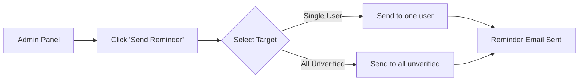

# Verification Reminder Email Feature

## Overview

Add a button in the Admin Panel to send reminder emails to unverified users, informing them they need to verify their account to log in.

---

## User Flow



---

## Proposed Changes

### Backend

#### [NEW] Email Template - `verificationReminderEmail`
File: `server/utils/emailTemplates.js`

Email content:
- ⚠️ Account not verified warning
- 📧 How to verify (re-register to get new OTP)
- 🔑 Forgot password? Use forgot password flow
- ⏰ Urgency message

---

#### [MODIFY] Admin Controller
File: `server/controllers/adminController.js`

```javascript
// Send reminder to single user
POST /api/admin/send-verification-reminder/:userId

// Send reminder to all unverified users
POST /api/admin/send-verification-reminder-all
```

---

#### [MODIFY] Admin Routes
File: `server/routes/adminRoutes.js`

Add routes for reminder endpoints.

---

### Frontend

#### [MODIFY] AdminDashboard.jsx
File: `client/src/pages/AdminDashboard.jsx`

- Add "Send Reminder" button next to unverified users
- Add "Remind All Unverified" bulk action button
- Show confirmation modal before sending

---

## Email Template Content

```
Subject: Complete Your Link Snap Account Setup 🔐

Hi [Name],

Your Link Snap account is almost ready! You just need to verify your email.

⚠️ Without verification, you won't be able to access your dashboard.

━━━━━━━━━━━━━━━━━━━━━━━━━━━━━━━━━━━━━━

🔑 OPTION 1: I REMEMBER MY PASSWORD

1. Go to Link Snap → Click "Login"
2. Enter your email & password
3. You'll be redirected to enter a verification code
4. Check your email for the 6-digit code → Enter it → Done! ✅

━━━━━━━━━━━━━━━━━━━━━━━━━━━━━━━━━━━━━━

🔄 OPTION 2: FORGOT PASSWORD / WANT TO UPDATE YOUR INFO

1. Go to Link Snap → Click "Get Started"
2. Sign up again with your email: [email]
3. Fill in your updated details
4. Enter the 6-digit code from your email → Done! ✅

Re-signing up lets you update:
• Password (if you forgot it)
• First Name & Last Name
• Phone Number
• Company Name

━━━━━━━━━━━━━━━━━━━━━━━━━━━━━━━━━━━━━━

Questions? Just reply to this email.

We're excited to have you onboard! 🚀

Best,
The Link Snap Team
```

---

## ⚠️ Edge Cases & Potential Issues

### 1. Bulk Email Rate Limiting
| Issue | Risk | Mitigation |
|-------|------|------------|
| Sending to 100+ users at once | Email provider blocks/throttles | Queue emails with 1-2 sec delay between sends |
| Spam detection | Emails marked as spam | Use proper email headers, limit daily sends |

### 2. User States
| Scenario | Expected Behavior |
|----------|-------------------|
| User already verified | Skip / Show error "User already verified" |
| Banned user (isActive=false) | Skip / Don't send reminder |
| User with no email | Skip (shouldn't happen, but guard) |
| Recently reminded user | Cooldown check (optional: 24hr limit) |

### 3. Concurrent Issues
| Issue | Mitigation |
|-------|------------|
| Admin clicks button twice | Disable button during request, debounce |
| Multiple admins send at same time | Idempotency check (lastReminderSent timestamp) |

### 4. Login Flow Edge Case
| Issue | Current Behavior | Note |
|-------|-----------------|------|
| OTP expires after user clicked login | User sees "OTP expired" | Consider auto-resend on login |
| User tries login but OTP never sent | No OTP exists | Login should trigger OTP generation |

### 5. Email Delivery
| Issue | Mitigation |
|-------|------------|
| Email bounces (invalid email) | Log failure, mark user |
| User marks as spam | Track unsubscribes (future feature) |

---

## Verification Plan

### Functional Tests
1. ✅ Send reminder to single unverified user
2. ✅ Bulk reminder to all unverified (test with 3-5 first)
3. ❌ Try to remind already verified user (should fail gracefully)
4. ❌ Try to remind banned user (should skip)
5. ✅ Verify email renders correctly in email clients

### Edge Case Tests
6. ⏱️ Double-click button (should only send once)
7. 📧 Check email doesn't go to spam
8. 🔄 Test cooldown if implemented

---

## Estimated Time: ~45 minutes
